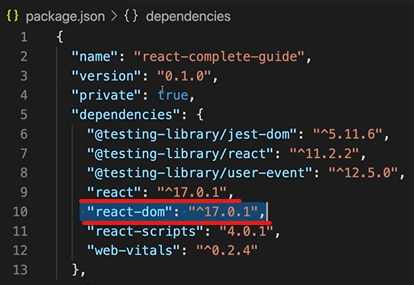

※이 게시글은 아래의 Udemy에 올라와 있는 리액트 강의를 들으며 정리해놓은 것입니다. 제 이해력의 부족으로 잘못된 정보를 전달할 수도 있음을 미리 알려드립니다.  
[React 완벽 가이드](https://www.udemy.com/course/best-react/)


리액트에서 가장 처음에 실행되는 코드는 index.js 이다.
```index.js``` 코드를 살펴보게 되면

이렇게 되어있는데, css 파일을 자바스크립트에서 불러오고 있다. 기존의 자바스크립트에서는 이건 문법적으로 불가능하다. 
리액트에서는 이걸 브라우저가 인식할 수 있도록 변환과정을 npm start 에서 거치도록 해서 더 편하게 이와 같은 형태로 작성할 수 있도록 해준다. 

또한 react dom 을 import 하는 것도 볼 수 있다. 
```packags.json``` 파일에 들어가서 보면

이렇게 리액트 와 리액트 돔을 볼 수 있다.
서로 다른 독립적인 라이브러리 이긴 하지만, 결국은 리액트를 나눈 것이라고 생각하면 된다. 이 2개가 같이 리액트 라이브러리를 이루기 때문이다. 

그리고 리액트는 단 하나의 html 파일을 가지고 SPA 싱글 페이지에서 작동하도록 해주는데 아래 이미지처럼 실제로 리액트 프로젝트를 생성하면 html 파일은 단 하나만 존재하는 것을 볼 수 있다


재밌는 부분은 이 html 코드를 살펴보면 body에는 단 하나의 코드만이 있는것을 볼 수 있다.

이렇게 id 가 root 인 코드 한줄이 적혀있는 것을 볼 수 있다. 
이것은 

여기서 마지막 줄에 getElement 를 통해 선택되는 부분이다.
즉, index.js 의 마지막 줄 코드가 의미하는 것은 index.html 의 root라는 id 를 가진 div 의 위치에 App이라고 하는 것을 렌더링 한다는 것이다. 그리고 이 App이라고 하는 것은 컴포넌트이다. 

그렇다면 이젠 App.js 파일을 보러 가보자
코드를 열어보면 정말... 코드들이 조그맣게 귀엽게 적혀있는 것을 볼 수 있다

그리고 얘가 하는 역할은 살펴보면 App이라고 하는 function을 보면 div로 감싸진 html 코드를 return 하고 있다.
이 방식은 자바스크립트에서 절대적으로 유효하지 않은 코드이지만 돌아간다(?).
왜냐하면 JSX 파일이기 때문에 가능한 것이다. JSX 는 리액트 팀에서 만든 자신만의 syntax 를 가진 파일이다. 다음 게시물에서 JSX 에 대해서 더 알아보도록 하겠다. 