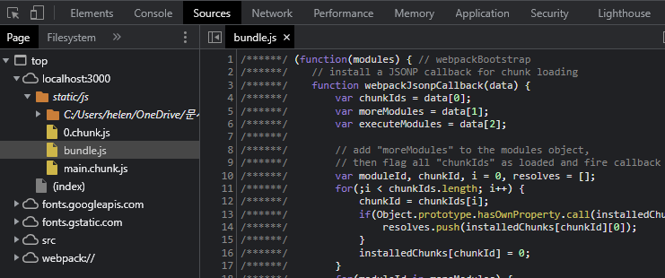
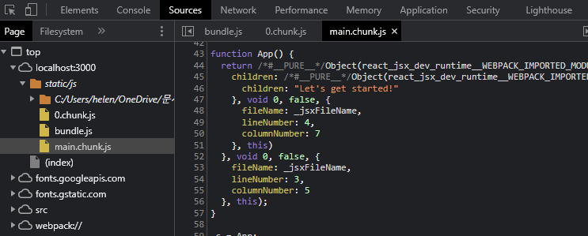

※이 게시글은 아래의 Udemy에 올라와 있는 리액트 강의를 들으며 정리해놓은 것입니다. 제 이해력의 부족으로 잘못된 정보를 전달할 수도 있음을 미리 알려드립니다.  
[React 완벽 가이드](https://www.udemy.com/course/best-react/)

리액트 실행결과를 보여주는 브라우저(여기서는 크롬을 추천한다)의 f12를 누르고 소스탭에 들어가면 static.js 밑에 자바스크립트 파일이 들어가 있는 것을 볼 수 있다. 


코드를 보면 우리가 봤던 ```App.js```에서 우리가 봤던 귀여운 코드랑은 거리가 먼 엄청난게 복잡한 코드가 적혀있는 것을 볼 수 있다. 이 코드들은 단순히 내가 직접적은 코드 뿐만이 아니라 리액트 전체를 위한 코드가 들어가 있기 때문이다.
ctrl+f해서 찾아보면 우리가 쓴 ```App()```을 찾을 수 있는 코드에 쓴것과는 많이 다른 형태임을 알 수 있다

우리는 리액트 팀에서 만든 특별한 JSX 문법으로 코드를 작성하고, npm start 를 하면 브라우저가 볼 수 있는 코드로 변환해주는 것이다. 얼마나 편한가!