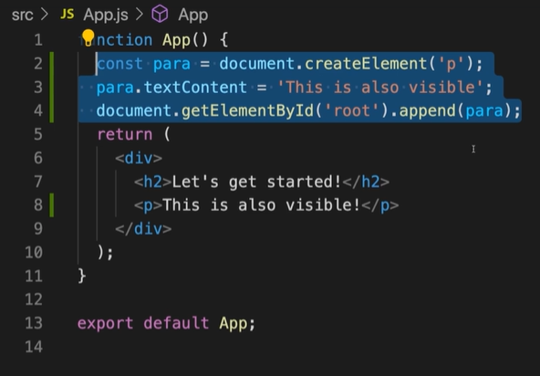

※이 게시글은 아래의 Udemy에 올라와 있는 리액트 강의를 들으며 정리해놓은 것입니다. 제 이해력의 부족으로 잘못된 정보를 전달할 수도 있음을 미리 알려드립니다.  
[React 완벽 가이드](https://www.udemy.com/course/best-react/)

## 컴포넌트가 동작하는 방식
컴포넌트란 기본적으로 자체 html 요소라고 생각하면 된다.
```App.js``` 에서 return 부분에 만약 아래처럼 p태그를 작성해서 넣으면


바로 그 결과가 나타나는데(물론 서버가 실행중일 때)


이렇게 원하는대로 적용된 것을 볼 수 있다. 


원래 자바스크립트로 결과창과 같이 만들기 위해서는 명령형(imperative) 접근 방식이나 innerHTML로 가능하다. 

아래는 명령형 접근 방식의 예시이다.


여기서 볼 수 있듯이 dom 에 내가 만들 태그 변수를 만들고, 해당 태그에 들어갈 텍스트를 적어주고, append 하는 과정을 거쳐야 한다.

자바스크립트에서 dom 의 엘리먼트에 접근하는 전체 과정을 순서대로 단계별로 정확하게 지시하고 있기 때문이다. 

하지만 이런 방식은 너무 복잡하고 나 같은 FE 새내기는 보자마자 포기할 거 같다....
