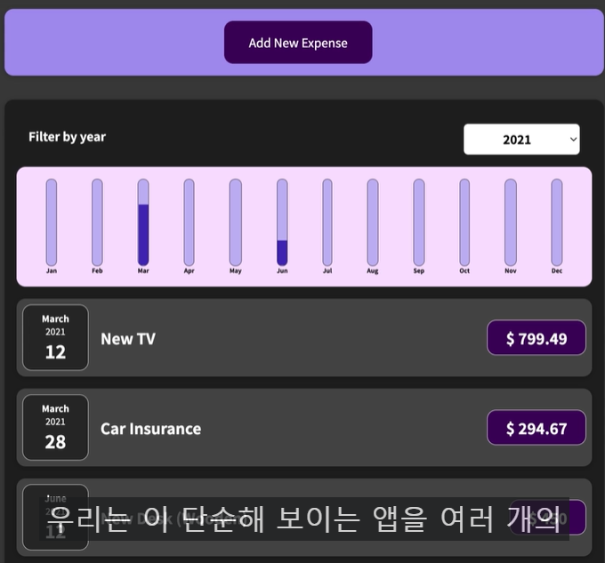
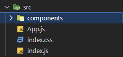
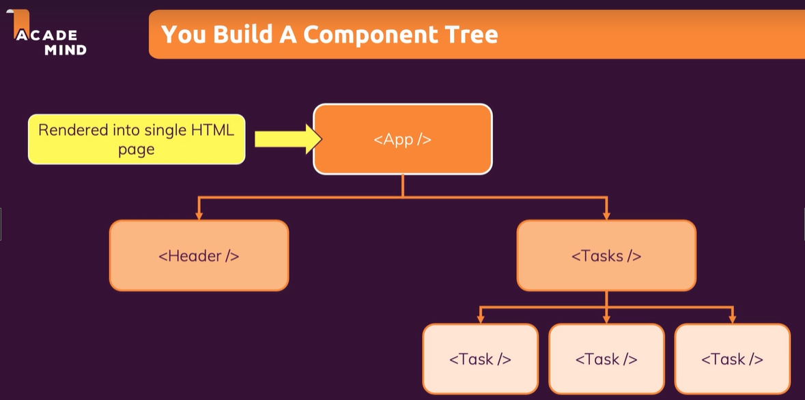
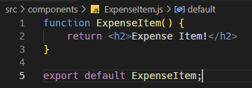
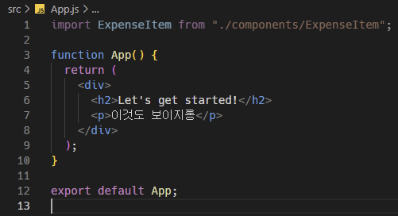
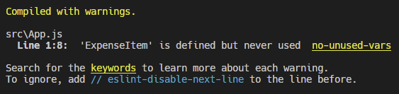
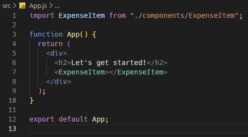
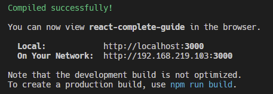
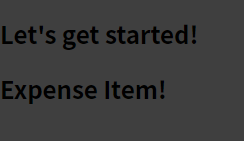

※이 게시글은 아래의 Udemy에 올라와 있는 리액트 강의를 들으며 정리해놓은 것입니다. 제 이해력의 부족으로 잘못된 정보를 전달할 수도 있음을 미리 알려드립니다.  
[React 완벽 가이드](https://www.udemy.com/course/best-react/)

## 직접 컴포넌트 만들어보기
이 강의에서 만들어볼 프로젝트의 최종모습은 아래와 같다.


먼저 관리하기 쉽도록 컴포넌트를 모아둘 폴더를 src 폴더 밑에 생성한다



```App.js```는 빼놓은 상태로 그대로 쓸것이다. 
왜냐하면 ```App.js```는 루트 컴포넌트로서 HTML로 직접 렌더링된다. 다른 컴포넌트들은 이 App.js 안에서 중첩되거나 또는 컴포넌트끼리 중첩되도록 하여 사용될 것이며 직접 지침에 따라 렌더링 되는것이 아닌 html 코드 안에 있는 보통의 html 요소들(보통의 html 요소들이 도대체 무엇을 말하는지 모르겠어서 그대로 베껴적었다... 나중에 확인해볼것) 을 사용해서 렌더링 될 것이다.
아래 사진은 컴포넌트 트리를 도식화한 것으로 위에 적어놓은 말을 이해하는데 도움이 될 것이다.


그럼 이제 본격적으로 컴포넌트를 만들어보자.
이름은 제일 앞글자는 대문자, 그리고 합성어의 경우 단어의 첫 문자는 대문자로 적어준다.
```ExpenseItem.js``` 이런식으로.

그럼 이제 빈 파일에 코드를 적어야 되는데, 컴포넌트란 과연 무엇인가?

> 리액트에 있는 컴포넌트는 단지 자바스크립트 함수일 뿐이다!

물론 컴포넌트는 반환하는 타입이 무려 html 코드인 특별한 JSX 문법이지만 결국은 자바스크립트 함수로서 기능하고 있기 때문이다. 

따라서 먼저 함수를 선언하고 함수안에 원하는 html 코드를 return 하도록 작성한다. 그리고 eport 를 반드시 해줘야 하는데, 그렇지않으면 다른 컴포넌트에서 해당 컴포넌트를 사용할 수 없게 된다.


그리고 직접적으로 렌더링 되는 것은 ```App.js``` 하나뿐이기에 ```index.js``` 는 건드릴 것 없이 넘어가고 ```App.js```에서 방금 만든 컴포넌트를 사용해야 한다.

이렇게 임포트를 하면 되는데, 이때 사용하지 않고 저장하면

아래사진 처럼 에러가 뜨게 된다.


임포트한 컴포넌트를 아래 이미지처럼 사용하게 되면 

이제 무사히 성공적으로 빌드되는 것을 볼 수 있다



여기서 중요하게 짚고 넘어가야 될 것이 있는데, 내장된 html 요소와는 다른 중요한 점은 내장된 html 은 소문자로 시작하는데, 사용자 지정 컴포넌트는 대문자로 시작한다는 점이다. 리액트는 소문자로 시작하는 요소는 html 로 인식하고 대문자로 시작하는 요소는 개발자에 의해 정의된 컴포넌트로서 인식하기 때문에 해당 규칙을 잘 지켜야 한다. 