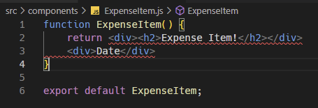
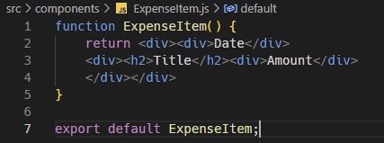
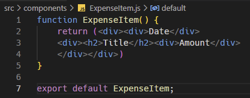
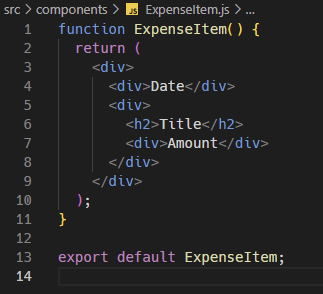
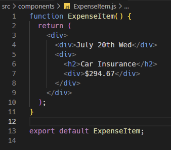

※이 게시글은 아래의 Udemy에 올라와 있는 리액트 강의를 들으며 정리해놓은 것입니다. 제 이해력의 부족으로 잘못된 정보를 전달할 수도 있음을 미리 알려드립니다.  
[React 완벽 가이드](https://www.udemy.com/course/best-react/)

JSX 코드는 우리가 html 에서 익히 쓰듯이 태그를 나눠서 쓰게되면 아래와 같이 에러가 나게 된다.

왜냐하면 JSX 코드 조각마다 루트요소를 단 하나만 갖는 다는 규칙이 있기 때문이다. 그래서 이런 경우에는 이 전체를 감싸는 태그를 만들면 에러가 사라지게 된다.

이렇게 태그로 감싸는 것 이외에 괄호를 치는 방법도 있다. 이것은 하나이고 한 문장이라고 알려주는 것이다. 

(괄호를 했으니 혹시 싶어 가장 바깥의 div 태그를 지웠더니 에러가 뜬다. 아니... 그러면 어차피 태그로 감쌌는데 굳이 다시 괄호를 왜 해?? **가.독.성** 때문입니다.)

여기서 나아가 괄호안에서 포맷팅을 해도 문제없이 동작하는 것을 볼 수 있다

여튼 여기에 그럼 컨텐츠를 넣고 돌리면?

잘 나오는 것을 볼 수 있다. 
다음 강의에서는 이 가독성 제로의 눈에 보이지도 않는 결과창을 css 를 적용해서 조금 더 예쁘게 보기 좋게 만들어 볼 것이다.