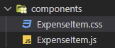
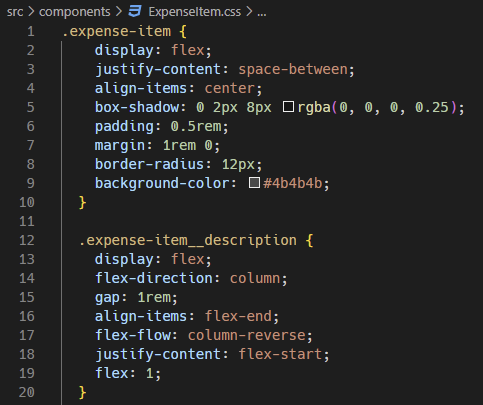
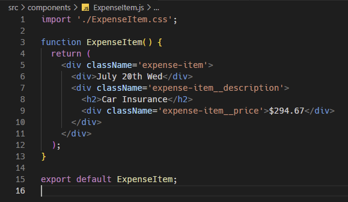
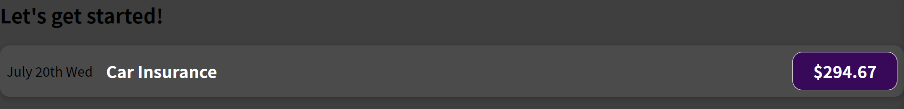

※이 게시글은 아래의 Udemy에 올라와 있는 리액트 강의를 들으며 정리해놓은 것입니다. 제 이해력의 부족으로 잘못된 정보를 전달할 수도 있음을 미리 알려드립니다.  
[React 완벽 가이드](https://www.udemy.com/course/best-react/)

먼저 css 파일을 똑같은 이름으로 확장자만 다르게 해서 만듭니다. 



그리고 안에 코드를 써넣어야 되는데, '이건 css 강좌가 아니니까 그냥 코드를 제공해줄테니 다운로드 받든, 코드를 복붙하든 하라'고 해서 기분좋게 복붙했다.
강좌를 수강하게 되면 아래 이미지처럼 되어있는데


링크로 들어가면 깃헙이 나오고 거기서 바로 코드를 확인할 수 있었다.


요렇게 코드를 복붙하면 되는데, 아래쪽에 더 길게 코드가 있었고, 이건 강사의 지적재산권인 만큼 다 공개하진 않겠다. 강의를 구매하셔서 보시기를...
> 아직 많이 듣지는 않았지만 설명이 친절하고 자세해서 추천한다. 99,000원으로 되어 있을텐데, 워낙 유데미는 할인을 자주해서 max 3일만 기다리면 만원 후반대(난 16,000에 샀다)로 살 수 있다.

이제 css 파일을 준비했으니 사용해야한다.
리액트는 전체 파일을 검사해서 한 번에 적용시켜주는 그런 기능이 없기 때문에 사용하거나 빌드에 참고해야 되는 파일이 있다면 구축을 시켜줘야 한다. 이를 위해서 ```ExpenseItem.js```에서 해당 컴포넌트에 적용할 ```ExpenseItem.css```를 임포트해준다. 

css 파일을 열어보면 다양한 클래스에 대해서 동작하도록 작성되어 있으므로 이를 활용하기 위해서는 각 태그에 클래스를 지어줘야 한다. 
여기서 재밌는 JSX 만의 문법이있다. 
> 바로 class="" 으로 html 방식으로 적는 것이 아닌 className="" 이렇게 적어야 한다는 것! 

앞에서도 말했지만 JSX 는 대부분이 html 과 비슷해보이도록 만들었지만 결국은 자바스크립트로 만들어진 것으로 완전히 똑같지 않다. 거기다가 자바스크립트에서 이미 class 는 예약어이기 때문에 className 으로 속성을 지정할 수 있도록 한 것이다. 


이렇게 작성하고 저장하면!

이렇게 훨씬 보기 좋은 모습으로 만들어진 것을 볼 수 있다.