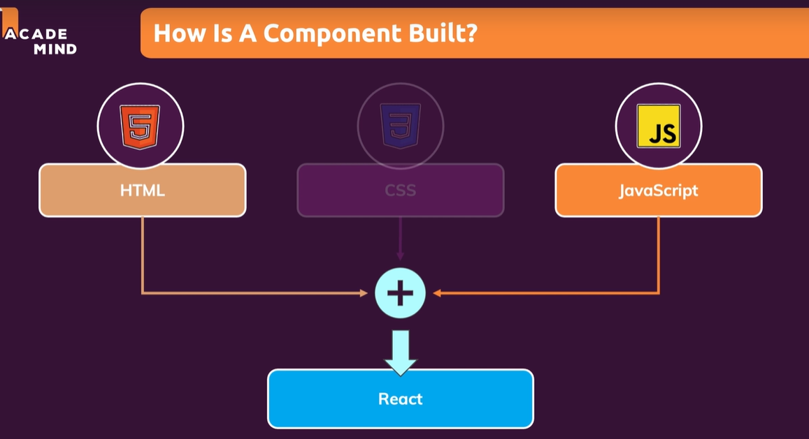
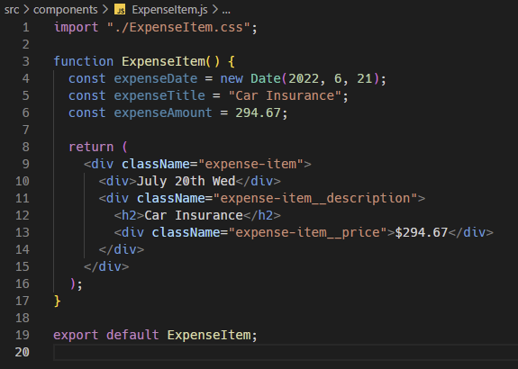
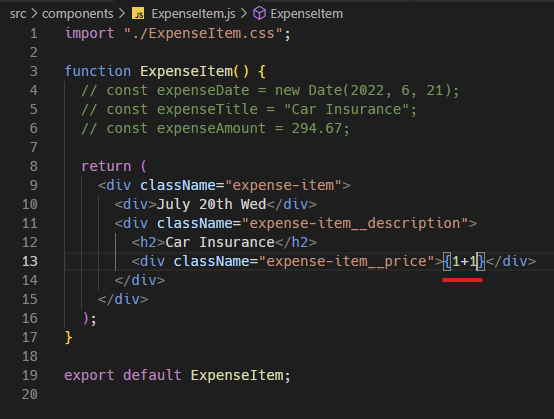
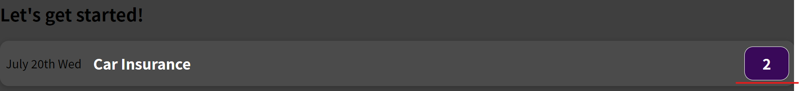
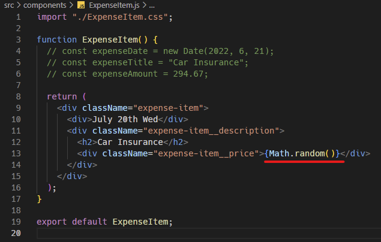
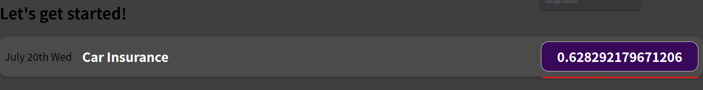
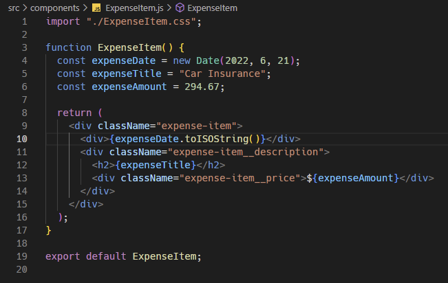
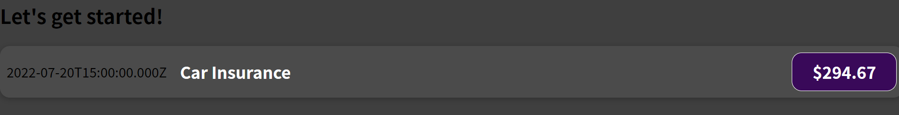

※이 게시글은 아래의 Udemy에 올라와 있는 리액트 강의를 들으며 정리해놓은 것입니다. 제 이해력의 부족으로 잘못된 정보를 전달할 수도 있음을 미리 알려드립니다.  
[React 완벽 가이드](https://www.udemy.com/course/best-react/)

지금까지 작성한 코드는 솔직히 말해서 html 자체에 데이터가 적혀있는데, 이렇게 쓰는 것은 코드의 재사용성에서 매우 안좋다.


원래 서비스에서는 DB에서 데이터를 가져오거나 해서 그 결과값을 출력해야 하는데, 일단은 여기서는 간단하게 자바스크립트 변수를 출력해서 마치 동적으로 데이터를 할당하는 것처럼 보이도록 해보겠다. 

이게 가능한 이유는 전에 컴포넌트는 html, css, 자바스크립트가 모두 같이 뭉쳐있는 형태이기 때문이다. 


따라서 자바스크립트 변수를 만들어서 아래 이미지처럼 사용할 수 있다.


이제 만들어진 변수를 사용해야 한다. 
여기서 또 재밌는 JSX 문법이 나온다. 바로 중괄호릏 사용한 문법인데, ```{1+1}```이런식으로 쓰게되면 화면에 그 계산한 결과값이 나온다. 



계산식 말고 자바스크립트 함수도 사용할 수 있다



그리고 만들어 둔 변수를 그대로 가져다가 쓸 수도 있다.
다만 주의해야 될 점이 있는데, 만약 expenseDate 는 스트링이 아니라 Date 객체라서 컴파일을 하지 못해 아무것도 결과창에 뜨지 않을 수 있다. 

따라서 아래처럼 Date 객체를 String 으로 바꿔주는 메소드를 붙여서 사용한다면!

우리가 원하는대로 동적으로 값을 할당해서 화면에 뿌릴 수 있게된다.
