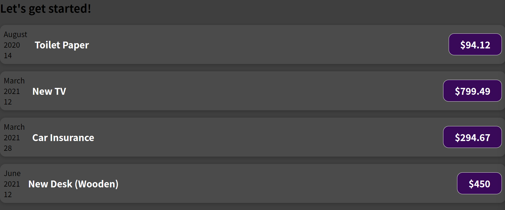

※이 게시글은 아래의 Udemy에 올라와 있는 리액트 강의를 들으며 정리해놓은 것입니다. 제 이해력의 부족으로 잘못된 정보를 전달할 수도 있음을 미리 알려드립니다.  
[React 완벽 가이드](https://www.udemy.com/course/best-react/)

이번 편에서는 props를 다뤘다.
props란 컴포넌트간의 데이터를 주고받기 쉽도록 해주는 것인데, 아래의 예시처럼 사용하면 된다. 

먼저 컴포넌트가 사용되는 상위 컴포넌트, 여기서는 App.js 가 된다. 
여기서 데이터를 만들어주고 해당 데이터를 컴포넌트별로 연결시켜준다.

그리고 컴포넌트로 들어가 받은 데이터를 연결해줘야 한다. 이때 App.js 에서 컴포넌트에 직접 썼던 변수 이름을 그대로 사용해야 된다. props로 보낼 때는 Date 객체가 그대로 유지되기 때문에 toISOString() 메소드를 사용하는 것을 잊지말자. 

이렇게 다 작성하면
아래처럼 우리가 원하던 동적으로 데이터를 바꾸면서 재사용까지 해낸 결과물을 볼 수 있다.

또 Date 날짜 형식을 좀 더 보기 좋게 만드는 과정을 거칠 것인데, props로 받은 데이터를 변수화 시켜서 사용하는 방법이 있다.

서버 시간 보듯이 알아보기 힘든 시간이 좀 더 보기 쉽게 바뀐 것을 볼 수 있다

이젠 ExpenseItem 을 더 작게 쪼개보자
날짜 부분을 달력처럼 만들기 위해서 이 부분을 나누어서 하위 컴포넌트 만들 계획이다.
먼저 아래처럼 파일을 만든다. (css 는 강사의 파일을 그대로 복붙했다)

그리고 나누어낼 부분을 덜어내서 ExpenseDate에 코드를 작성한다.

데이터를 받아와서 사용해야 되니까 그 부분도 잘 붙여넣고, props 도 꼭 적어줘야 된다

그리고 Item 에선 하위 컴포넌트를 임포트해서 전달해줄 데이터를 잘 집어넣어준다. 하위 컴포넌트의 변수명을 고려해서 똑같이 적어서 만들어줘야 한다.

이렇게 우리가 원하는 달력 형태를 볼 수 있게 됐다.