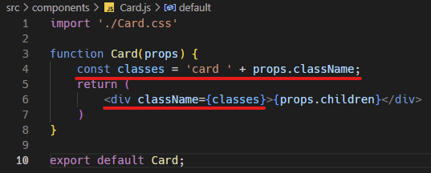
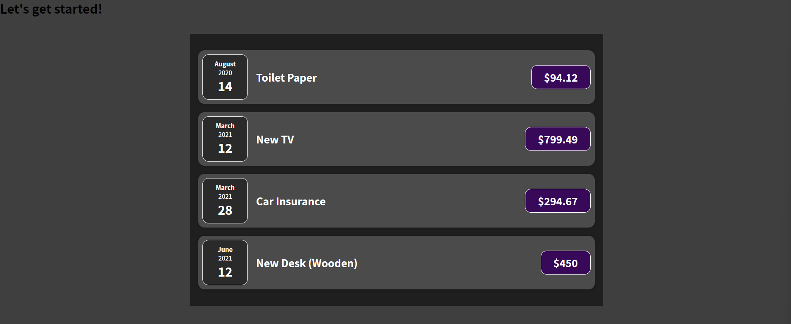

※이 게시글은 아래의 Udemy에 올라와 있는 리액트 강의를 들으며 정리해놓은 것입니다. 제 이해력의 부족으로 잘못된 정보를 전달할 수도 있음을 미리 알려드립니다.  
[React 완벽 가이드](https://www.udemy.com/course/best-react/)

## 전체 비용 아이템을 담을 박스 만들기
 :warning: 해당 박스 작성부분은 강의에서 없...었어서 (왜 이러냐 잘 나가다가 왜 이래) 코드보고 그냥 이해한대로 적었습니다. 이상할 수 있어요.

이제 비용 아이템을 감싸는 박스를 만들어보겠다. 
지금 현재로는 전체 페이지에 꽉 채워서 컴포넌트들이 채워져있는데, 이걸 박스안에 담으면 더 보기 좋지 않을까?

우리가 원하는 모습은 아래 사진과 같다. 

이제 이와 같은 형태로 만들기 위해서 전체를 묶어줄 Expenses.js 와 해당 박스의 스타일을 담당할 Expenses.css 파일을 만들어준다. (당연히 components 폴더에 만들어야 겠죠?)


먼저 우리가 만들어둔 ExpenseItem 블럭을 감싸는 더 상위의 컴포넌트를 통해서 데이터가 들어가야 된다. 이 때문에 원래는 App.js 에서 바로 Item 을 호출해서 사용했지만 여기서는 Expenses 컴포넌트 임포트해서 사용하게 된다. 
그리고 데이터를 보내줄 때는 한 번에 묶어서 ```items={expenses}```와 같이 코드를 작성해준다.


이제 그럼 원래 App.js 에서 있었던 코드를 Expenses.js 에 그대로 가지고 가서 복붙한다. css 스타일도 적용해야 되니까 임포트와 className 작성하는것도 잊지 않는다.


그러면 우리가 원하는 모습으로 나오게 된다. 

---
## Composition, Wrapper 만들기와 props.children
 :warning: 이 부분은 강의도 있었고 분명 봤지만 이해가 조금 어려워서... 생각정리용으로 쓴거라 선후관계나 그 영향을 이상하게 적었을 수 있습니다. 

이제 처음과는 비교도 안될 정도로 정리된 페이지를 볼 수 있다. 다만 여러 css 파일을 살펴보면 
```css
    border-radius: 12px;
    box-shadow: 0 1px 8px rgba(0, 0, 0, 0.25);
```
위의 코드와 같은 둥글게 모서리 처리하는 코드와 박스 밑에 그림자효과를 넣는 것이 중복되는 것을 볼 수 있다. 
이를 한 번에 적용시키기 위해서 Card라고 하는 컴포넌트를 만들어서 적용시키려 한다. 

역시나 먼저 ```Card.js``` 와 ```Card.css``` 파일을 만든다. 


그리고 Card 를 만들어줘야 되는데, 이렇게 기본적인 형태로 먼저 만들어둔다. 그리고 우리가 만든 card.css 에 위의 겹치는 코드를 붙여넣고 저장한 뒤, 이 스타일을 모든 Card 컴포넌트에 적용시켜 주기 위해서 className 까지 설정해준다. 
 


그리고 카드 컴포넌트 형식을 만들어진 ExpenseItem 모두에 적용시킬 것이기 때문에 ExpenseItem.js 에서 최상위 계층의 div 태그를 Card 태그로 바꿔서 Card.css 스타일을 적용해주고, 원래 css 파일 스타일도 적용해주기 위해서 className 을 설정해줍니다. 


그리고 이렇게 설정하고 저장하면!
두둥 블랭크... 우리의 데이터가 사라졌습니다. 와중에 재밌는 건 우리가 App.js 안에서도 Expense 부분만이 지금 에러가 나고 있는것이라서 Let's get started 는 무사히 볼 수 있군요.


이렇게 데이터가 보이지 않는 이유는 바로 상자 밖에 있기 때문이다. 
> Card.js 처럼 사용자 지정 컴포넌트는 마치 div 태그처럼 컨턴체를 감싸는 래퍼(Wrapper)로 사용할 수 없기 때문이다.

우리가 원하는 것은 사용자 지정 컴포넌트로도 마치 내장된 html 요소처럼 래퍼 컴포넌트로 동작할 수 있게 만드는 것이다. 그리고 다행히 리액트는 이에 대한 솔루션을 가지고 있다. 바로 리액트에 내장된 특별한 props를 사용하는 것이다.

> props.children 은 어떠한 작업도 없이 기본적으로 설정되는 예약어이다. 이를 사용하면 사용자 지정 컴포넌트에 있는 열고 닫는 태그 사이에 있는 컨텐츠의 내용을 표시할 수 있도록 해준다. 

아래는 공식문서에 들어가서 확인한 결과이다. 

> It contains the content between the opening and closing tags of a component.  
(props.children은 컴포넌트의 시작과 끝 사이에 있는 컨텐츠들을 가지고 있다.)


즉, 원래는 내장 html 요소가 아니면 사이에 끼어있는 컨텐츠를 하나의 박스로 묶을 수 없는데, props.children 을 사용하면 안의 있는 컨텐츠를 하나의 묶음으로 만들어주기 때문에 화면에 표시가 된다는 것 같다. 

위의 공식문서의 예시를 참고하여 아래처럼 작성하면 이제 사라진 데이터가 돌아오는 것을 볼 수 있다. 


이렇게 저장하면 위의 화면을 볼 수 있는데, 뭔가 이상하지 않은가... 스타일이 깨진 상태인 것을 볼 수 있다. 
그 이유는 Card.css 에 공통적으로 가지고 있는 일부 스타일을 추출했는데, 이를 제외한 원래 적용되던 스타일(expense-item 과 같은) 사라졌기 때문이다. 

분명 Card 에 className 을 설정했는데도, 이렇게 되는 이유는 Card 가 사용자 지정 컴포넌트이기 때문이다. 박스 밖에 있는 모든 디폴트 내장 html 요소들은 렌더링된 html 요소에게 css 클래스를 추가하는 className 을 지원한다. 하지만 사용자 지정 컴포넌트는 개발자 본인이 스스로 지원하라고 지시한 것만 지원하기 때문에 className 이 동작하지 않는 것이다. 

그래서 이 className 이 설정되길 원한다면 내가 만든 Card.js 컴포넌트에 가서 수정을 해줘야 한다. 

아래의 코드처럼 내가 className 속성으로 값을 담아서 넘기고 이를 받아서 변수로 만든 다음 적용하면 css 클래스 2가지가 모두 적용된다. 

그리고 결과창을 보게 되면

이렇게 아이템 부분은 이제 제대로 스타일이 적용된 것을 볼 수 있다. 
우리는 이미 사용자 지정 컴포넌트인 Card 를 Wrapper 로서 사용할 수 있도록 만들었기에 이를 그대로 Expense.js 에 적용시키면 바깥쪽 박스까지 디자인이 바뀔 것이다. 

아래가 적용된 결과이다.


---
그래서 왜 우리는 굳이 컴포지션을 이렇게 나눈걸까?
결과물만 봐서는 처음우리가 박스를 씌운상태랑 완벽히 똑같은 상태인데, 이를 위해서 컴포넌트를 만들고 생각보다는 공수가 많이 들어간다. 그럼에도 이렇게 나누는 이유가 무엇일까?

우리는 현재 양이 많지는 않아도 분명 중복되는 css 코드를 추출해서 사용할 수 있게 했다. 추출은 css 뿐만이 아닌 html 코드, JSX 코드 모두가 가능하다. 

이후 강좌의 내용이 경고창과 모달창을 만들게 돠면서 더 어렵고 복잡해질 것이다. 
> 이런 상황에서 원하는 특정 코드를 추출할 수 있다는 것은 수 많은 코드의 중복을 피할 수 있게 해준다는 것이다. 

리액트 공식문서의 고급 안내 가이드에서도 Composition(조합) 을 사용하라고 안내하고 있다. 

링크와 본문을 복붙해뒀는데, 귀찮은 분들을 위해 짧게 축약하자면, 
> 컴포넌트 자체를 return 하게 되면 이 자체로 이것은 컴포넌트를 변경시키는 것과 같으며 이로 인해 컴포넌트의 주입 관계를 알지 못한채 사용하게 되면 충돌이 발생할 수 있다.  

> 조합을 사용한다면 그 자체는 순수한 함수의 형태이기 때문에 충돌발생 여지가 확연하게 적어지며 조합, 특히 Wrapper 로 감싸서 사용하는 방식을 써도 충분히 원하는대로 잘 동작하는 코드를 짤 수 있다. 

[컴포넌트를 변경하지 말고, 조합을 사용하세요](https://reactjs.org/docs/higher-order-components.html#dont-mutate-the-original-component-use-composition)

<details>
<summary>리액트 공식문서 고급 가이드 본문(영어)</summary>
<div markdown="1"> 
###Don’t Mutate the Original Component. Use Composition.

Resist the temptation to modify a component’s prototype (or otherwise mutate it) inside a HOC.
```javascript
function logProps(InputComponent) {
  InputComponent.prototype.componentDidUpdate = function(prevProps) {
    console.log('Current props: ', this.props);
    console.log('Previous props: ', prevProps);
  };
  // The fact that we're returning the original input is a hint that it has
  // been mutated.
  return InputComponent;
}

// EnhancedComponent will log whenever props are received
const EnhancedComponent = logProps(InputComponent);
```

There are a few problems with this. One is that the input component cannot be reused separately from the enhanced component. More crucially, if you apply another HOC to EnhancedComponent that also mutates componentDidUpdate, the first HOC’s functionality will be overridden! This HOC also won’t work with function components, which do not have lifecycle methods.

Mutating HOCs are a leaky abstraction—the consumer must know how they are implemented in order to avoid conflicts with other HOCs.

Instead of mutation, HOCs should use composition, by wrapping the input component in a container component:

```javascript
function logProps(WrappedComponent) {
  return class extends React.Component {
    componentDidUpdate(prevProps) {
      console.log('Current props: ', this.props);
      console.log('Previous props: ', prevProps);
    }
    render() {
      // Wraps the input component in a container, without mutating it. Good!
      return <WrappedComponent {...this.props} />;
    }
  }
}
```

This HOC has the same functionality as the mutating version while avoiding the potential for clashes. It works equally well with class and function components. And because it’s a pure function, it’s composable with other HOCs, or even with itself.

You may have noticed similarities between HOCs and a pattern called container components. Container components are part of a strategy of separating responsibility between high-level and low-level concerns. Containers manage things like subscriptions and state, and pass props to components that handle things like rendering UI. HOCs use containers as part of their implementation. You can think of HOCs as parameterized container component definitions.

</div>
</details>
