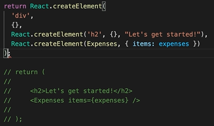
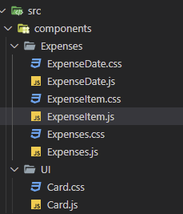
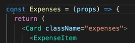

※이 게시글은 아래의 Udemy에 올라와 있는 리액트 강의를 들으며 정리해놓은 것입니다. 제 이해력의 부족으로 잘못된 정보를 전달할 수도 있음을 미리 알려드립니다.
[React 완벽 가이드](https://www.udemy.com/course/best-react/)

## import React form 'react'
원래는 package.json 의 react와 react-dom 모두를 임포트 해야만 사용할 수 있었다.
최근의 리액트에서는 react import 구문은 쓰지 않아도 렌더링되도록 잘 만들어져 있다.
JSX 코드를 쓰기 위해서는 react 를 반드시 써야 하지만, 단지 이젠 눈에 안보일뿐 뒷단에서 꾸준히 쓰이고 있음을 반드시 알고 있어야 한다.

## JSX 문법
JSX 코드 부분을 리액트가 뒷단에서 변환해주기 때문에 우리는 쉽게 웹서비스를 만들 수 있다. 만약 JSX 코드를 쓸 수없다면
아래와 같이 직접 코딩을 해야한다. 

이런 코딩을 훨씬 가독성을 향상시킨 것이 바로 JSX 이다. 그리고 이 구조를 보면 왜 최상의 wrapper 가 있어야 하는지 알 수 있다. 
최상위 래퍼가 없다면 return 을 2개로 해야되는데, return 원래 하나만 할 수 있으므로 에러가 발생한다. 배열로 만든다면 가능하겠지만, 여러 객체를 쓰는것은 배열 형태가 아니므로 에러가 발생하는 것이다.

## 폴더 정리
코드의 가독성과 직관성을 높이기 위해서 폴더를 정리하는 것이 좋다.
이번에 만든 서비스의 경우, Expenses 와 UI 폴더로 나누어서 정리할 것인데, 이렇게 하면 각 임포트구문에서 경로를 제대로 바꿔줘야 동작한다.
이렇게 코드를 정리하는 방법은 프로젝트 팀원들간의 합의를 통해서 가장 잘 맞는 정리 방법을 찾아기키는 것이 꼭 필요하다.

## 자바스크립트의 화살표 함수
오롯이 개인 취향에 따라 작성하면 된다. 화살표 함수를 쓴다고 해서 더 좋은 장점이 따로 있는 것은 아니기 때문이다. 
아래 사진처럼 사용하면 된다.
